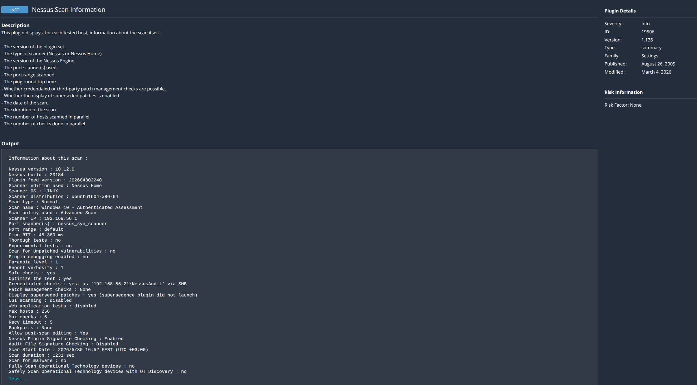
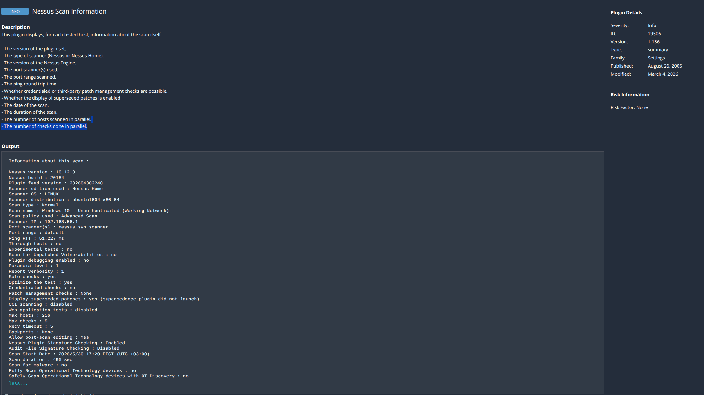

# Case Study: Credentialed vs. Non-Credentialed Vulnerability Assessment

## 🎯 1. Objective
The purpose of this lab was to demonstrate the critical visibility gap between an unauthenticated (outside-in) network scan and an authenticated (inside-out) vulnerability assessment against a local target host.

---

## 💻 2. Environment Architecture
* **Host Operating System:** Ubuntu Linux 24.04 running Tenable Nessus Essentials.
* **Target Operating System:** Windows 10 Virtual Machine (VirtualBox).
* **Network Configuration:** Host-Only network adapter interface (`192.168.56.x`) to isolate traffic and allow direct Layer 2 communication between the Ubuntu auditor and the Windows guest.

---

## 🛠️ 3. Implementation Steps & Triage
Modern operating systems actively block remote administrative scanning by default. To enable successful authenticated auditing, the following host-hardening triage steps were executed on the Windows 10 target:
1. **Account Provisioning:** Created a dedicated local administrative auditor account (`NessusAudit`).
2. **Firewall Remediation:** Resolved a connection disconnect by implementing an explicit inbound firewall rule (`New-NetFirewallRule`) to open the Windows Defender Firewall to incoming ICMPv4 traffic to verify line-of-sight.
3. **Service Management:** Configured and forced the `Remote Registry` service to start automatically to allow remote patch level querying.
4. **User Account Control (UAC) Bypass:** Implemented a registry modification by creating the `LocalAccountTokenFilterPolicy` DWORD key set to `1` inside `HKLM\SOFTWARE\Microsoft\Windows\CurrentVersion\Policies\System`. This explicitly allowed local administrative tokens to be passed over network interfaces via SMB.

---

## 📊 4. Key Findings & Data Delta

| Metric | Unauthenticated Scan (Baseline) | Authenticated Scan (Result) |
| :--- | :--- | :--- |
| **Authentication Status** | **Fail** (Network-only perimeter) | **Pass** (Successful SMB Login) |
| **Critical Vulnerabilities**| 0 | **5** |
| **High Vulnerabilities** | 0 | **21** |
| **Medium Vulnerabilities** | 7 | **9** |
| **Informational Logs** | 45 | **110** |
| **Scanning Depth** | Limited to open ports / banners. | Deep registry, local file system, and binary audits. |

* **The Unauthenticated Blindspot:** The network-only scan reported a false sense of security with zero high or critical risks because the scanner was stopped dead at the network perimeter.
* **The Authenticated Reality:** Once Nessus authenticated through the Windows perimeter, it detected **26 severe vulnerabilities** (5 Critical, 21 High) including missing Windows 10 Cumulative updates (operating on an outdated legacy 21H2 branch), obsolete .NET frameworks, and outdated local software like Microsoft Edge.

---

## 🔍 5. Forensic Evidence & Proof of Execution

Because Tenable Nessus Essentials restricts raw binary data exports, execution integrity is forensically proven via the raw string logs extracted from **Nessus Plugin 19506 (Nessus Scan Information)**. 

### 1. Authenticated Assessment (Deep Inspection Proof)
* **Scan Run Time:** 1231 Seconds (~20.5 minutes of deep registry auditing)
* **Credentialed Status:** Verified successful administrative login via SMB.

### 2. Unauthenticated Assessment (Perimeter Blindspot Baseline)
* **Scan Run Time:** 495 Seconds (~8 minutes of basic port scanning)
* **Credentialed Status:** No credentials supplied (Network perimeter scan only).

---

## 📝 6. Conclusion
This lab proves that perimeter-based scanning leaves security teams functionally blind to internal asset health. True risk management requires authenticated, credentialed access to verify actual binary versions on disk, ensuring missing patches and local configuration vulnerabilities are accurately identified and remediated.
